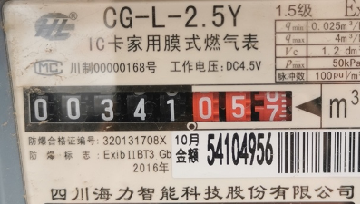
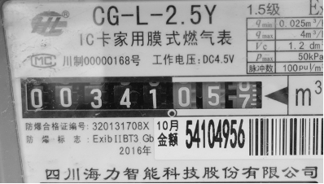
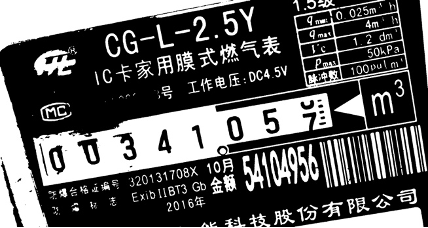
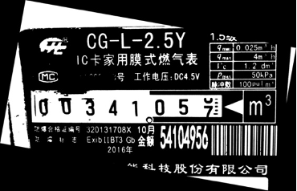
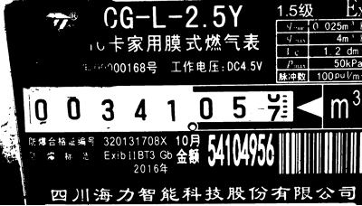
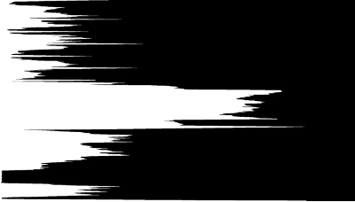
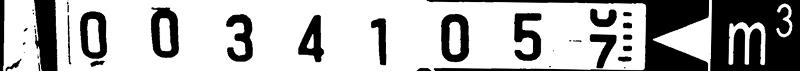
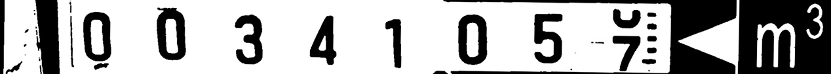
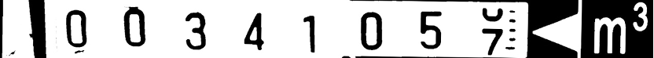

# Gas-Meter-Reading-Recognition
Gas Meter Reading Recognition Algorithm Based on Digital Image Processing

## Part 1: Data Preprocessing

(a) Turning Grey

(b) Grey-Scale transformation

(c) Filter the Image 

(d) Binarization using Otsu

## Part 2: Positioning and Segmentation of Digital Areas

(a) Rectify Image

(b) Horizontal Projection

(c) Segmentaion of Single Numbers
* Dilation 

* Vertical Projection

## Part 3: Recognization of Numbers using Neural Network
